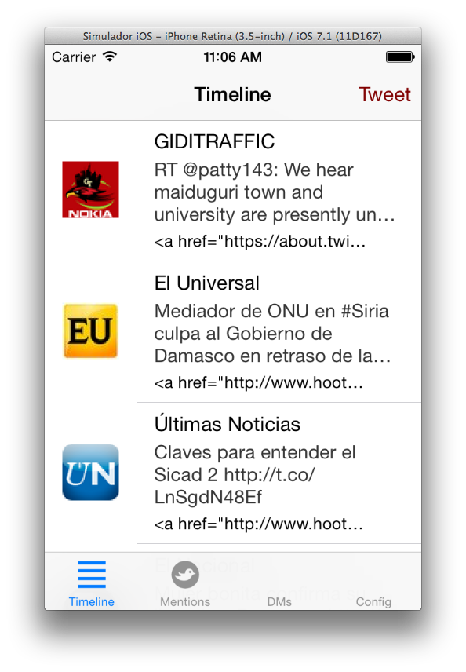
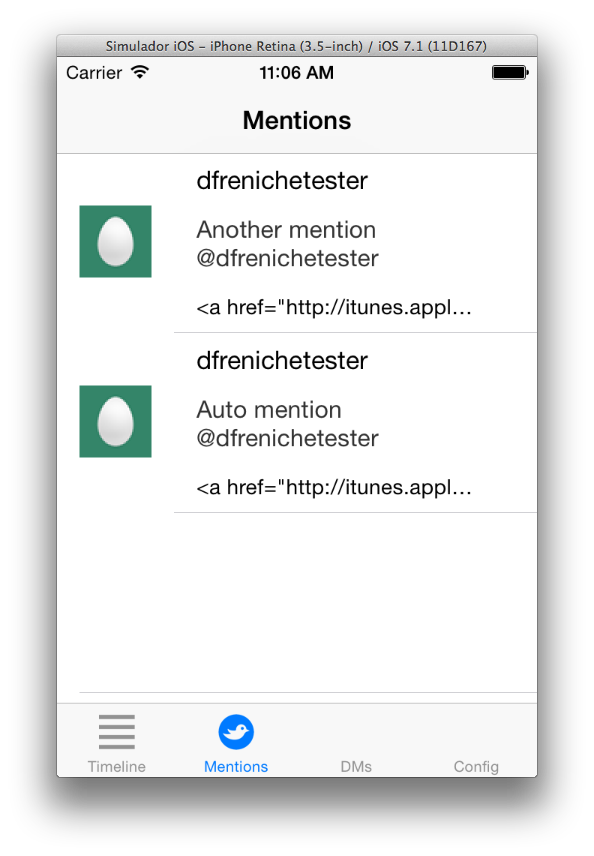
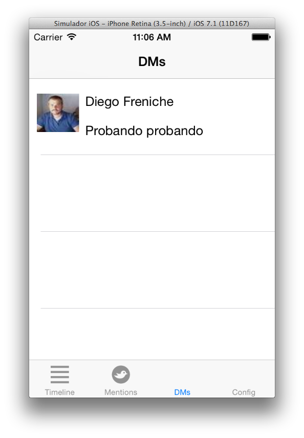

#TwiOS

A simple iOS Twitter client

Made as an example for an iOS course
- Shows timeline
- Mentions
- DMs
- Some info

Uses CocoaPods and the excellent [STTwitter library](https://github.com/nst/STTwitter) (for DMs) 

# Important

To make this work you __need__ to add a file called: TwitterPrivateKeys.h
With your Twitter keys.

	//
	//  TwitterPrivateKeys.h
	//  TwiOS
	//
	//  Created by Diego Freniche Brito on 14/03/14.
	//  Copyright (c) 2014 freniche. All rights reserved.
	//
	
	#ifndef TwiOS_TwitterPrivateKeys_h
	#define TwiOS_TwitterPrivateKeys_h
	
	#define CONSUMER_KEY = "XXX";
	#define CONSUMER_SECRET = "XXX";
	
	#endif

# ScreenShots

## Timeline

## Mentions

## DMs

---

## License

MIT